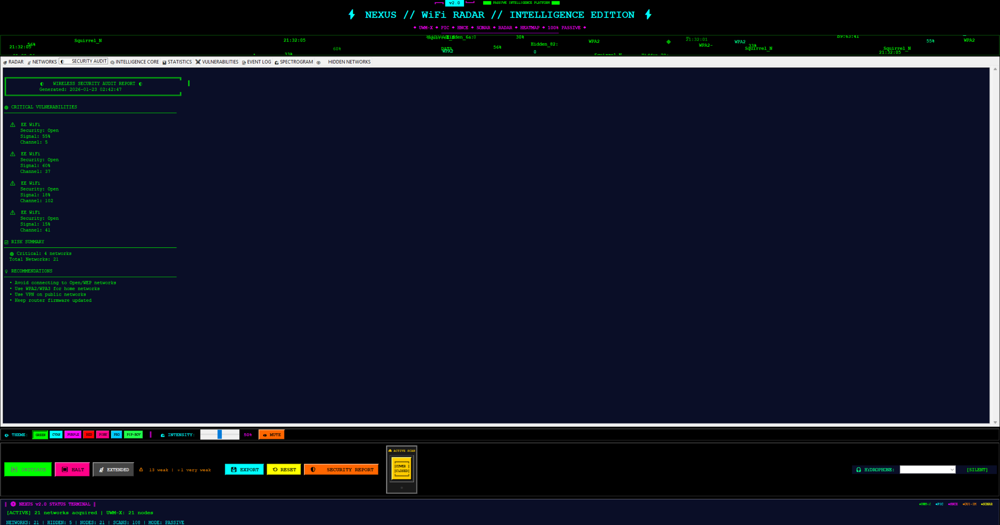
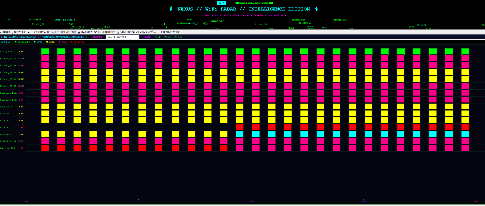

```
 ███╗   ██╗███████╗██╗  ██╗██╗   ██╗███████╗
 ████╗  ██║██╔════╝╚██╗██╔╝██║   ██║██╔════╝
 ██╔██╗ ██║█████╗   ╚███╔╝ ██║   ██║███████╗
 ██║╚██╗██║██╔══╝   ██╔██╗ ██║   ██║╚════██║
 ██║ ╚████║███████╗██╔╝ ██╗╚██████╔╝███████║
 ╚═╝  ╚═══╝╚══════╝╚═╝  ╚═╝ ╚═════╝ ╚══════╝
 
     WiFi Radar V2.0 • Intelligence Core • IoT Detection
         [INTELLIGENCE EDITION] [AI-NATIVE BUILD]
```

---

## 🧠 NEXUS V2 | INTELLIGENCE CORE UNLEASHED

📡 **Next-generation WiFi threat detection with AI-powered intelligence analysis, smart device identification, and real-time threat assessment across Windows and Linux platforms.**

> **Version 2.0 Evolution**: Built on the foundation of [NEXUS V1](https://github.com/13thrule/Nexus-Wifi-Radar), this release introduces the **Passive Intelligence Core (PIC)**, **Universal World Model (UWM-X)**, **Hidden Network Classification Engine (HNCE)**, and **OUI Intelligence Module (OUI-IM)** - transforming WiFi scanning into comprehensive intelligence gathering.


```
━━━━━━━━━━━━━━━━━━━━━━━━━━━━━━━━━━━━━━━━━━━━━━━━━━━━
  🎄 BUILT: January 2026 (72-hour AI sprint continues!)
  🤖 PLATFORM: Claude Sonnet 4.5 (AI-Assisted Evolution)
  📝 CODE WRITTEN MANUALLY: ZERO LINES (Still!)
  ✅ RESULT: Intelligence-Grade Network Analysis Platform
━━━━━━━━━━━━━━━━━━━━━━━━━━━━━━━━━━━━━━━━━━━━━━━━━━━━
```

---

## � SCREENSHOTS & GALLERY
## 🖼 Screenshots & Gallery

### Launcher / Splash

*Launcher splash and mode selector (launcher view)*

### Intelligence Dashboard — Three-Panel Analysis

*Real-time intelligence analysis with threat detection and inspector*

### Radar Display — Active Scanning

*Cyberpunk radar interface with real-time scanning and blips*

### Radar Heatmap

*Signal strength heatmap visualization*

### Hidden Networks — Classification

*Hidden network classification and cluster analysis*

### Smart Device Detection

*IoT device identification with icons and vendor info*

### Security Audit Report

*Built-in security audit output and findings*

### Theme Gallery

*Six cyberpunk themes: Neon Green, Cyan, Purple, Red, Pink, Pip-Boy*

---

## �🚀 WHAT'S NEW IN V2.0

### 🧠 Intelligence Core Architecture
NEXUS V2 introduces a **complete intelligence system** that doesn't just scan networks—it **understands them**:

```
[PIC] Passive Intelligence Core ........... AI-powered network classification
[UWM-X] Universal World Model ............. Temporal tracking & spatial mapping  
[HNCE] Hidden Network Classifier .......... Smart hidden network analysis
[OUI-IM] OUI Intelligence Module .......... 300+ vendor database with IoT detection
[EASM] Enhanced Active Scan Mode .......... Hidden network discovery (Linux)
```

### 🚪 Smart Device Detection
V2 **knows what's on your network**:

- 🚪 **Ring Doorbell** detection
- 📹 **Security Cameras** (Ring, Blink, Arlo, Wyze)
- 🔊 **Smart Speakers** (Amazon Echo, Google Home, Sonos)
- 💡 **Smart Home** devices (Philips Hue, Nest, SmartThings)
- 🎮 **Gaming Consoles** (PlayStation, Xbox, Nintendo)
- 📺 **Streaming Devices** (Roku, Chromecast, Fire TV)
- 📶 **Router Detection** (BT Hub, EE, Sky, Virgin Media, Netgear, TP-Link)
- 🌐 **Amazon Sidewalk** mesh networks
- 🏢 **Enterprise WiFi** (Aruba, Cisco, Ruckus, Cambium)

### 📊 Three-Panel Intelligence Dashboard
```
┌──────────────────────────────────────────────────────────────┐
│  🧠 NEXUS INTELLIGENCE DASHBOARD // PASSIVE ANALYSIS CORE    │
├───────────────────┬──────────────────┬────────────────────────┤
│   📈 SUMMARY      │   📡 FEED        │   🔍 DETAIL INSPECTOR  │
│                   │                  │                        │
│  Networks: 15     │ [THREAT] Spoof   │  🚨 THREAT             │
│  Threats: 1       │ Detected         │                        │
│  Hidden: 2        │                  │  SEVERITY: ▓▓▓▓░       │
│  Weak: 3          │ [INSIGHT] New    │                        │
│  Moving: 1        │ Network Found    │  Potential Spoof       │
│                   │                  │  Network shows 3       │
│                   │ [ANOMALY]        │  spoof indicators      │
│                   │ Erratic Signal   │                        │
│                   │                  │  Risk: medium          │
│                   │ [PASSIVE]        │  Vendor: 🚪 Ring       │
│                   │ Network Gone     │  Signal: 85% (-52dBm)  │
│                   │                  │  Distance: ~5.2m       │
└───────────────────┴──────────────────┴────────────────────────┘
```

**Real-time event classification:**
- 🚨 **THREAT** - Spoofing, rogue APs, security vulnerabilities
- ⚠️ **ANOMALY** - Erratic signals, stability issues, unusual patterns
- 💡 **INSIGHT** - New networks, device discoveries, proximity alerts
- 📡 **PASSIVE** - Network disappearances, normal observations
- ⚙️ **SYSTEM** - Scan summaries, environment status

---

## 🎮 CORE FEATURES

### WiFi THREAT DETECTION
```
[SCAN] 47 Networks Found
[PIC] 15 Device Types Classified
[THREAT] Potential Spoof Detected: [Hidden]
[INSIGHT] New Network: 🚪 Ring Doorbell (~3.5m)
[ANOMALY] Erratic Signal: BT-Hub (~8m)
[INTEL] 🌐 Amazon Sidewalk mesh detected
```

### INTELLIGENCE ENGINES

**Passive Intelligence Core (PIC)**
- Device classification (router, mobile, IoT, printer, gaming, etc.)
- Security rating (WPA3 Excellent → Open Critical)
- Threat assessment with confidence scoring
- Relationship mapping (mesh groups, APs, client devices)

**Universal World Model (UWM-X)**
- Temporal tracking (first seen, last seen, observation count)
- Movement detection (stationary, moving, fast_moving)
- Signal stability analysis (stable, unstable, erratic)
- Spatial mapping with distance estimation

**Hidden Network Classification Engine (HNCE)**
- **Network types**: guest_isolated, iot_hub, enterprise_backhaul, mesh_node, legacy_device, rogue_candidate
- **Rogue detection**: Spoof likelihood scoring (0-100%)
- **Cluster analysis**: Mesh network discovery
- **Outlier detection**: Unusual hidden networks

**OUI Intelligence Module (OUI-IM)**
- **300+ manufacturer database**: Apple, Samsung, TP-Link, Netgear, BT Hub, Ring, Amazon
- **Smart MAC detection**: Handles locally-administered MACs (guest networks)
- **Vendor types**: Enterprise, mesh, IoT, consumer, mobile
- **Device-specific icons**: 🚪🔊💡📹🎮📺📶

### SIGNAL VISUALIZATION
```
HEATMAP VIEW:
┌─────────────────────────────────────┐
│ ░░▒▒▓▓██████▓▓▒▒░░░░░░░░░░░░  │ -45dBm
│ ░░░░▒▒▓▓█████▓▓▒▒░░░░░░░░░░░  │ -50dBm
│ ░░░░░░▒▒▓▓███▓▓▒▒░░░░░░░░░░░  │ -55dBm
│ ░░░░░░░░▒▒▓▓█▓▓▒▒░░░░░░░░░░░  │ -60dBm
└─────────────────────────────────────┘
```

### ENHANCED ACTIVE SCAN MODE (EASM)
**Linux only** - Discover hidden networks through packet injection:
```
[EASM] Active scanning mode ENABLED
[EASM] Injecting probe requests...
[EASM] ⚡ Revealed hidden network: 62:45:b2:... (Guest WiFi)
[EASM] ⚡ Revealed hidden network: 82:ea:0b:... (🚪 Ring Device)
```

---

## 🎨 THEME SUPPORT

NEXUS V2 includes **6 cyberpunk themes** with dynamic color switching:

| Theme | Vibe | Primary Color |
|-------|------|---------------|
| 🟢 **NEON GREEN** | Classic cyberpunk (default) | `#00ff00` |
| 🔵 **NEON CYAN** | Cool tech aesthetic | `#00ffff` |
| 🟣 **NEON PURPLE** | Dark cyberpunk | `#ff00ff` |
| 🔴 **NEON RED** | Alert mode | `#ff0000` |
| 💗 **NEON PINK** | Synthwave style | `#ff0088` |
| 🟩 **PIP-BOY** | Fallout-inspired terminal | `#20ff4b` |

**Dynamic theme switching**: All UI elements update instantly when you change themes - tabs, text, borders, graphs, even the radar blips!

---

## 🚀 QUICK START

### 📦 Windows - 2 Minutes
```powershell
# 1. Clone the repository
git clone https://github.com/13thrule/Nexus-Wifi-Radar-V2.git
cd Nexus-Wifi-Radar-V2

# 2. Run the installer
.\install.bat

# 3. Launch NEXUS
.\run_scanner.bat
```

That's it! No Python knowledge needed. The installer handles everything.

### 🐧 Linux / Raspberry Pi - 5 Minutes
```bash
# 1. Clone the repository
git clone https://github.com/13thrule/Nexus-Wifi-Radar-V2.git
cd Nexus-Wifi-Radar-V2

# 2. Run the installer
chmod +x install.sh
./install.sh

# 3. Launch NEXUS
python3 -m nexus gui

# Optional: Enable EASM for hidden network discovery
sudo python3 -m nexus gui --easm
```

**System Requirements:**
- Python 3.8+
- Windows 10/11, Ubuntu 20.04+, Raspberry Pi OS
- WiFi adapter (built-in or USB)
- For EASM (Linux): Monitor mode capable WiFi adapter

---

## 📂 REPOSITORY STRUCTURE

```
Nexus-Wifi-Radar-V2/
│
├─ nexus/                           Core intelligence modules
│  ├─ __main__.py                   CLI entry point
│  ├─ app.py                        Main GUI application
│  ├─ launcher.py                   Mode selector UI
│  │
│  ├─ audio/                        Audio sonar system
│  │  └─ sonar.py                   Real-time threat audio feedback
│  │
│  ├─ core/                         Intelligence engines
│  │  ├─ config.py                  Configuration management
│  │  ├─ distance.py                RSSI→distance estimation
│  │  ├─ easm_manager.py            Enhanced Active Scan Mode
│  │  ├─ fingerprint.py             Device fingerprinting
│  │  ├─ hidden_classifier.py       Hidden Network Engine (HNCE)
│  │  ├─ intelligence.py            Passive Intelligence Core (PIC)
│  │  ├─ models.py                  Data structures
│  │  ├─ oui_vendor.py              OUI database (OUI-IM)
│  │  ├─ radar_modes.py             Scanning modes
│  │  ├─ scan.py                    Cross-platform scanner
│  │  ├─ stability.py               Signal stability tracking
│  │  ├─ vendor.py                  Vendor lookup (300+ OUIs)
│  │  └─ world_model.py             Universal World Model (UWM-X)
│  │
│  ├─ platform/                     Platform adapters
│  │  ├─ generic_linux.py           Linux nmcli/iwlist
│  │  ├─ raspberry_pi.py            RPi optimizations
│  │  └─ windows.py                 Windows netsh
│  │
│  ├─ security/                     Security analysis
│  │  ├─ detection.py               Threat detection
│  │  ├─ report.py                  Security reporting
│  │  ├─ rules.py                   Detection rules
│  │  └─ spoof.py                   Spoof detection engine
│  │
│  └─ ui/                           User interfaces
     ├─ cli.py                      Terminal UI
     ├─ heatmap.py                  Signal heatmap
     ├─ intel_dashboard.py          Intelligence Dashboard
     ├─ radar.py                    Radar visualization
     └─ skins/                      Theme system
        └─ pipboy.py                Pip-Boy theme
│
├─ tests/                           Test suite
├─ docs/                            Documentation
│  ├─ ARCHITECTURE.md               System design
│  ├─ ENHANCED_ACTIVE_SCAN.md       EASM guide
│  └─ FEATURES.md                   Feature reference
│
├─ install.bat                      Windows installer
├─ install.sh                       Linux/Mac installer
├─ run_scanner.bat                  Windows launcher
├─ pyproject.toml                   Project metadata
├─ QUICKSTART.md                    Quick start guide
├─ CONTRIBUTING.md                  Contribution guide
└─ LICENSE                          MIT License
```

---

## 🎮 USAGE EXAMPLES

### Launch GUI (Windows)
```cmd
run_scanner.bat
```

### Launch GUI (Linux/Mac)
```bash
python3 -m nexus gui
```

### Enable Active Scanning (Linux only)
```bash
sudo python3 -m nexus gui --easm
```

### CLI Mode
```bash
python3 -m nexus cli --duration 30
```

### Launcher Mode
```bash
python3 -m nexus launcher
```

---

## 📊 V1 → V2 COMPARISON

| Feature | V1 | V2 |
|---------|----|----|
| **Core System** | Basic WiFi scanning | Intelligence Core (PIC + UWM-X + HNCE + OUI-IM) |
| **Device Detection** | Vendor name only | 🚪 Smart device icons (Ring, Echo, cameras, etc.) |
| **Hidden Networks** | Listed only | Full classification + threat analysis |
| **UI Panels** | Single radar view | 3-panel Intelligence Dashboard |
| **Event System** | No events | Real-time event feed with detail inspector |
| **Threat Detection** | Basic | Advanced spoof detection with confidence scoring |
| **Vendor Database** | ~50 OUIs | 300+ OUIs with IoT devices |
| **Active Scanning** | Not available | EASM mode for hidden network discovery (Linux) |
| **Stability Analysis** | No | Yes - erratic signal detection |
| **Distance Estimation** | Basic | Wall-aware distance + room classification |
| **Theme System** | 5 themes | 6 themes with dynamic switching |
| **Documentation** | Basic | Comprehensive (Architecture, Features, Contributing) |

---

## 🔧 ADVANCED FEATURES

### Intelligence Dashboard Filters
```
FILTER:  [ALL] [🚨 THREAT] [⚠️ ANOMALY] [💡 INSIGHT]
```
Filter events by type for focused analysis.

### Smart Device Icons
When scanning, V2 automatically identifies devices:
```
Networks List:
🚪 Ring Doorbell        95%  Ch.6   WPA2    
📹 Blink Camera         82%  Ch.11  WPA2    
🔊 Amazon Echo          88%  Ch.1   WPA2    
📶 BT Hub               99%  Ch.6   WPA2    
📱 Apple iPhone         75%  Ch.36  WPA2    
🎮 PlayStation 5        91%  Ch.44  WPA2    
```

### Hidden Network Analysis
```
Hidden Networks Tab:
BSSID              VENDOR            CH    RSSI    TYPE              FLAGS
62:45:b2:11:5...   🎲 Randomized     6     -67dBm  guest_isolated    ⚠️SPOOF
82:ea:0b:99:6...   🚪 Ring Doorbell  11    -47dBm  iot_hub           ⚡OUT
```

### World Model View
Track every network's complete history:
- First seen / Last seen timestamps
- Total observation count
- Movement state (stationary / moving / fast_moving)
- Signal stability rating
- Estimated distance over time

---

## ⚠️ LEGAL & ETHICAL USE

**Authorized Use:**
- ✅ Test networks you own or have permission for
- ✅ Educational security analysis
- ✅ WiFi optimization and planning
- ✅ Home network monitoring
- ✅ IoT device discovery on your network

**Prohibited Use:**
- ❌ Unauthorized network access
- ❌ Network scanning without consent
- ❌ Illegal surveillance
- ❌ Any unlawful activity

**Use responsibly. You are responsible for compliance with all applicable laws.**

---

## 📝 LICENSE

MIT License - See [LICENSE](LICENSE) file for details.

```
This software is provided for educational and authorized testing only.
Users are responsible for ensuring all use complies with applicable laws.
Developers are not responsible for misuse of this software.
```

---

## 🎓 THE EVOLUTION CONTINUES

V1 proved something important: **You don't need to be a "traditional programmer" to build professional software.**

V2 proves the **next step**: You can take a working project and **evolve it into something even more powerful** through iteration, clear vision, and AI assistance.

### What Changed From V1 to V2?

1. **Architecture**: Modular intelligence engines replace monolithic scanning
2. **Intelligence**: Classification, tracking, and analysis replace simple listing
3. **UI**: Three-panel dashboard replaces single radar view
4. **Detection**: Smart device recognition replaces generic vendor lookup
5. **Documentation**: Professional docs replace basic README

### The Process

```
1. Start with working V1
2. Identify limitations
3. Design intelligence architecture
4. Implement engines one by one
5. Test, iterate, refine
6. Ship V2
```

**Time investment**: Another 72-hour sprint. **Code written manually**: Still zero lines.

---

## 📞 SUPPORT

```
[?] Documentation:  See docs/ folder
[?] Quick Start:    See QUICKSTART.md
[?] Issues:         Open an Issue on GitHub
[?] Questions:      Check FEATURES.md
```

---

## 🎓 FINAL THOUGHT

**V1 taught me I could build.**  
**V2 taught me I could architect.**

If you're reading this and thinking "I could never design a system like this" — yes, you can.

The architecture isn't magic. It's:
1. **Clear vision** of what you want
2. **Modular thinking** (break big problems into small pieces)
3. **AI assistance** to implement each piece
4. **Iteration** until it works

Start simple. Build V1. Then build V2. Then V3.

**You're only limited by your imagination and your willingness to iterate.**

```
Built with 🖥️💻🧠⚡ over January 2026
Made possible by AI-assisted development
Designed for security professionals, network engineers,
IoT enthusiasts, and anyone who believes code is just a tool.

The vision is yours. The implementation is AI's. 
The success is shared.

━━━━━━━━━━━━━━━━━━━━━━━━━━━━━━━━━━━━━━━━━━━━━━━━━━━━
Last Updated: January 23, 2026
Status: PRODUCTION READY V2.0
Next Update: When you decide to build V3.0
━━━━━━━━━━━━━━━━━━━━━━━━━━━━━━━━━━━━━━━━━━━━━━━━━━━━
```

**🟢 NEXUS V2 ACTIVE. INTELLIGENCE CORE ONLINE. READY FOR DEPLOYMENT. 🟢**

---

## 🔗 Links

- **V1 Repository**: [Nexus-Wifi-Radar](https://github.com/13thrule/Nexus-Wifi-Radar)
- **V2 Repository**: [Nexus-Wifi-Radar-V2](https://github.com/13thrule/Nexus-Wifi-Radar-V2)
- **Documentation**: See [docs/](docs/) folder
- **Quick Start**: See [QUICKSTART.md](QUICKSTART.md)
- **Contributing**: See [CONTRIBUTING.md](CONTRIBUTING.md)

---

**Ready to deploy intelligence-grade WiFi analysis? Pick your platform and get started! 🚀**

*And if you build V3 with even more features, share it - you might inspire someone else like V1 inspired V2.*
